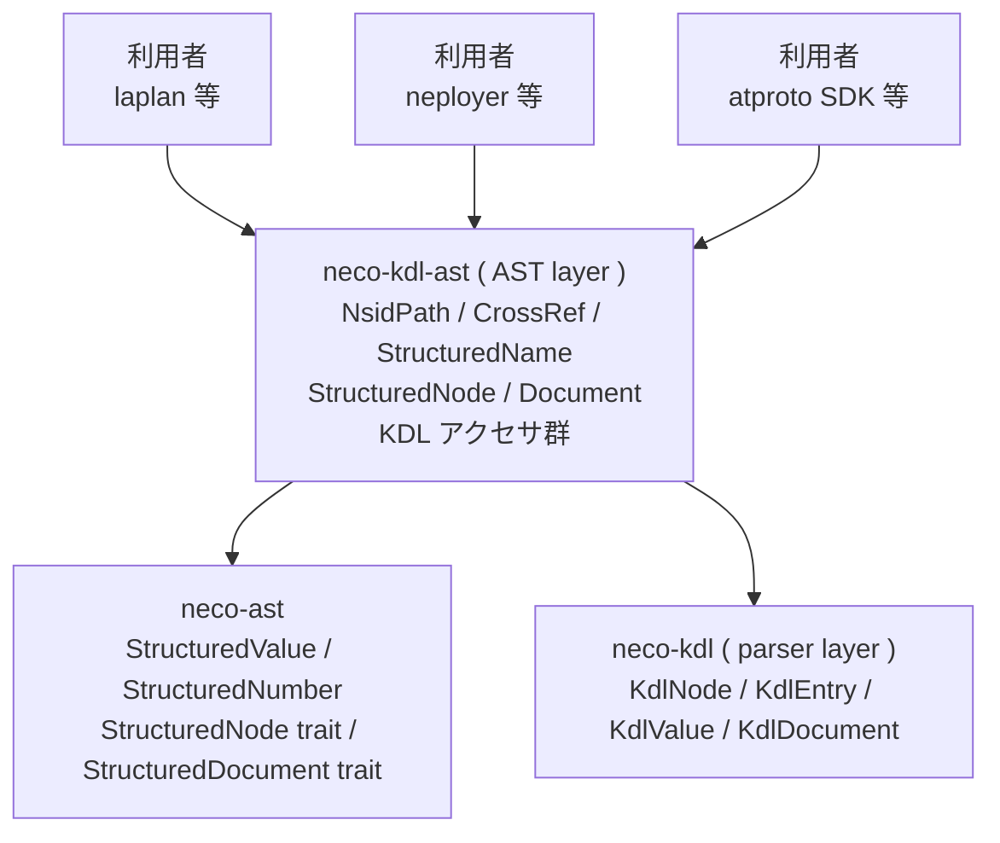

# neco-kdl-ast アーキテクチャ概要

## 位置付け

`neco-kdl` ( parser ) は KDL syntax を 論理構造 ( `KdlNode` の木 ) に落とす責務に閉じる。 `""` の有無等の表記差は parser 層で normalize され、 内部で等価扱いになる。

`neco-kdl-ast` ( AST layer ) は parser の出力に 名前空間パス / 参照 / 構造化命名 / 手続きの入れ子表記の richer な抽象を載せる。 KDL を構造化 IR の入れ物として使う 利用者 ( laplan / neployer / atproto SDK 等 ) が共通に必要とする操作を集約し、共有 `neco-ast` trait も実装する。

## parser 層と AST 層の責務 ( 2 層 framing )

AST layer は **「parser + パラメータ化可能な normalizer」** の 2 層構造として位置付ける:

| 層 | 責務 |
|---|---|
| `neco-kdl` ( parser ) | KDL syntax → 論理構造 ( `KdlNode` の木 )。 表記差 ( 引用の有無、 escape、 whitespace ) は normalize される。 native KDL 全要素を保持 |
| `neco-kdl-ast` ( AST / パラメータ化可能な normalizer ) | 論理構造 + 利用者 が宣言する Convention で、 名前空間パス / 参照 / 構造化命名 / 手続きの入れ子 / 5 軸の同型変換 を提供 |

`lex` / `app` / `integer` / `string` 等の **semantic keyword 自体は 利用者 領域**で、 AST layer はこれらに reserved word として特別な意味を持たせない。 ただし 利用者 が「この prefix は marker」 「この kind 名は marker」 を Convention 経由で declare すれば、 その意味論等価性を構造的 往復変換 として吸収する。

表記差に semantic を持たせたい 利用者 が現れた場合、 その責務は AST 層が パラメータ化可能な normalizer として引き受ける ( 詳細は [reference/syntax § Convention と Marker](../reference/syntax.md) )。 raw form 保持系 API は現状提供しない。

`Convention` には marker reserved word の list に加えて軸 1-5 ごとの **正規形宣言** ( `AxisForm` / `PropertyChildForm` ) を持たせ、 `Document::render_as(&Convention) -> Document` がその宣言に従って軸 5 → 4 → 1 → 2 → 3 順 ( marker 境界保護順 ) で per-axis 変換を orchestrate する ( 詳細は [reference/syntax § Convention の正規形宣言](../reference/syntax.md) )。 既定 `Convention` は全軸 `Off` で、 既存 read accessor の振る舞いを完全互換に保つ ( downstream 追従ゼロ )。

## 利用 利用者 と 主要な KDL 表現

AST layer は次の 3 種類の使われ方をする:

| 利用者 | 主要 KDL 表現 | 特徴 |
|---|---|---|
| laplan ( `.lex` ) | `lex` / `cratis` / `morph` / `morph.derives` / `func.family` / `law` / `inverse` / `dual` / `handler` / `chain` / `import` / `lexicon` / `face` | dotted node 名 ( form Y )、 nsid identifier 多用、 参照 に `#fragment` |
| neployer ( `config.kdl` ) | `app` / `target` / `package` / `service` / `bindings` / `produces` / `accepts` / `meta` / `palette` | flat node 名 ( form X )、 fact key で nsid 散発、 参照 に fragment 不要 |
| atproto ( Lexicon JSON の KDL projection ) | `lexicon` ( form Y )、 内部に `params` / `output` / `defs` 等 | type annotation `(T)V` 頻発、 参照 に `<nsid>#<defName>` 形式の fragment |

3 者の共通基盤 ( namespace + 参照 + 構造化命名 ) を AST layer が引き受け、 各 利用者 は domain 固有の解釈のみ書く。

## 共有構造参照

共有構造参照は `neco-ast` が担う。`StructuredValue<'a>` は null / bool / number / string / sequence / mapping の値木を表し、`StructuredNumber<'a>` は raw 文字列表現と `f64` 解釈結果を同時に保持する。`StructuredNode<'a>` と `StructuredDocument<'a>` は形式別の値を node と文書として読む trait である。

`neco-kdl-ast` は KDL 固有の `NsidPath` / `CrossRef` / layout 判定 / dot-chain アクセサ群 を保持しつつ、`Document` と `StructuredNode<'a>` に `neco-ast` の共有 trait を実装する。JSON / TOML / YAML / JSON5 / XML / plist は各 `*-ast` crate が同じ trait を実装する。

## 主要型

| 型 | 役割 |
|---|---|
| `NsidPath` | dot-separated 名前空間パス、 segment 列。 FS path への双方向 mapping を提供 |
| `CrossRef` | 別 entity への参照、 `<NsidPath>#<fragment>` の 3 形式を吸収 |
| `StructuredName` | `{ kind: Option<NsidPath>, identifier: NsidPath }`、 form X / form Y を統一表現 |
| `StructuredNode<'a>` | `KdlNode` の borrowed view + kind / identifier / 入れ子 depth 解釈 |
| `Document` | `KdlDocument` の owned wrapper + 索引 / resolve / 往復変換 + `render_as(&Convention) -> Document` |
| `Convention` | 利用者宣言の marker list + 軸 1-5 の per-axis 正規形宣言 ( `AxisForm` / `PropertyChildForm` ) |
| `AxisForm` | 軸 1 / 2 / 4 / 5 用 enum: `Off` / `Expand` / `Collapse` / `ExpandWithMarker(Marker)` / `CollapseWithMarker(Marker)` |
| `PropertyChildForm` | 軸 3 専用 enum: `Off` / `Expand` / `Collapse` ( 融合形のみ、 enum axiom ) |
| `StructuredFacade<'a>` | 既存 KDL 利用者向けに保持する 5 method trait |
| `neco_ast::StructuredNode<'a>` | `StructuredNode<'a>` が実装する共有構造参照 trait |
| `neco_ast::StructuredDocument<'a>` | `Document` が実装する共有文書 trait |

詳細な構文と worked example は [reference/syntax](../reference/syntax.md) を参照。
