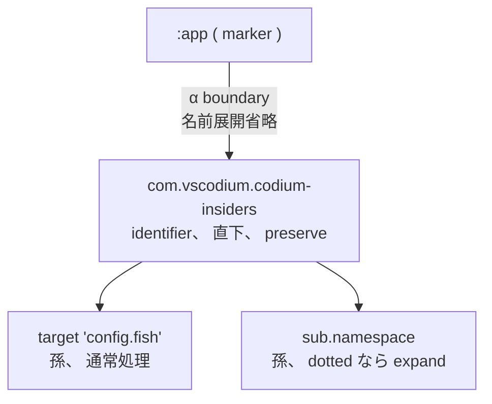

# neco-kdl-ast 構文リファレンス

KDL を構造化 IR の入れ物として使う際の表記規律と、 各規律の worked example を示す。

## 用語

| 用語 | 定義 |
|---|---|
| segment | NsidPath を構成する単位、 1 つの非空文字列 |
| NsidPath | 0+ 個の segment の有限列、 string 表現は segment を `.` で連結 |
| fragment | CrossRef 内で `#` の右に置かれる単一 identifier |
| form X | KDL node 表現で `<kind keyword> "<identifier>"` 形 ( `lex "i64.add"` 等 ) |
| form Y | KDL node 表現で node 名そのものに NsidPath を埋め込む形 ( `i64.add { ... }` 等 ) |
| layout mode | FS path と NsidPath の対応の strictness、 strict 1:1 / bundle / cratis dir の 3 mode |

## NsidPath

NsidPath は 0+ 個の segment の有限列。 各 segment は **空でない**文字列、 `.` と `#` を含まない。

### 表記

```
"a"           ← 1 segment OK
"a.b.c"       ← 3 segment OK
""            ← 0 segment OK ( local-only CrossRef で使用 )
"a..b"        ← NG: 連続 . で空 segment
"a.#x.b"      ← NG: segment "#x" が # を含む
".a.b"        ← NG: leading . で空 segment ( ただし node 名 leading dot は手続き入れ子表記で別解釈、 後述 )
```

検査は `NsidPath::is_well_formed()` で行う。

### parse / display の 往復

```rust
NsidPath::parse("")          // → 空 NsidPath ( segments == [] )
NsidPath::parse("a.b.c")     // → segments == ["a", "b", "c"]
NsidPath::parse("a.b.c").display()  // → "a.b.c" ( 往復 )
```

任意の well-formed `s` で `NsidPath::parse(s).display() == s`。

### FS path との対応

n segment NsidPath は FS path materialization で **同 n の path component 深度** を持つ:

```
NsidPath::parse("app.bsky.actor.getProfile").to_fs_path("json")
// → PathBuf "app/bsky/actor/getProfile.json"   ( 3 dir + 1 leaf = 4 path component )

NsidPath::from_fs_path(
    Path::new("axiom/encoding/base64.lex"),
    Path::new("axiom/")
)
// → Some(NsidPath ["encoding", "base64"])      ( ext "lex" を strip、 dir + file stem を join )
```

base 配下から外れる path、 segment が `.` / `#` を含むような違反 path は `None`。

## CrossRef

別 entity への参照を表す。 表記は `<NsidPath>#<fragment>` 形、 `#` を **高々 1 個** 含む、 fragment は flat identifier ( `.` も `#` も含まない、 空でない )。

### 3 形式

```
"a.b.c"        ← path 部のみ                     → CrossRef { path: [a,b,c], fragment: None }
"a.b.c#frag"   ← path + fragment                 → CrossRef { path: [a,b,c], fragment: Some("frag") }
"#frag"        ← local-only ( current document ) → CrossRef { path: [], fragment: Some("frag") }
```

### parse error 4 種

| error | 例 |
|---|---|
| `MultipleHashes` | `"a#b#c"` ( # が 2 つ以上 ) |
| `EmptyFragment` | `"a.b.c#"` ( # の右が空 ) |
| `DotInFragment` | `"a.b.c#x.y"` ( fragment に . が混入 ) |
| `EmptySegment` | `"a..b"` ( 連続 . で空 segment 発生 ) |

### worked example

```
laplan の chain step
  step "str.find" input="h,n" output="idx"
  → CrossRef::parse("str.find") = path:[str,find], fragment:None

atproto Lexicon の output ref
  output "app.bsky.actor.defs#profileViewDetailed" encoding="application/json"
  → CrossRef::parse("app.bsky.actor.defs#profileViewDetailed")
    = path:[app,bsky,actor,defs], fragment:Some("profileViewDetailed")

atproto union 内の local ref
  refs ["#main" "#profileView"]
  → CrossRef::parse("#main") = path:[], fragment:Some("main"), is_local=true

neployer の app dependency
  requires { app "kitty" }
  → CrossRef::parse("kitty") = path:[kitty], fragment:None
```

## NsidPath を表現する 4 form

n segment NsidPath は KDL / FS で 4 通りの表現を持つ。 各 form の階層深度は同 n。

### 例: `app.bsky.actor.getProfile` ( 4 segment )

#### flat KDL form X ( kind keyword + quoted identifier )

```kdl
lex "app.bsky.actor.getProfile" {
    procedure { ... }
}
```

#### flat KDL form Y ( node 名に NsidPath 埋め込み )

```kdl
app.bsky.actor.getProfile {
    procedure { ... }
}
```

#### nested KDL ( 4 nesting level )

```kdl
app {
    bsky {
        actor {
            getProfile {
                procedure { ... }
            }
        }
    }
}
```

#### FS materialization ( strict 1:1 mode、 3 dir + 1 leaf file )

```
<base>/app/bsky/actor/getProfile.<ext>
```

### 例: `encoding.base64` ( 2 segment ) を bundle で

`axiom/encoding/base64.lex` は 2 dir + 1 file path component で `encoding.base64` を表す。 file 内には複数 entity があり、 各 entity の identifier は file path を strict prefix として持つ:

```kdl
// file: axiom/encoding/base64.lex
lex encoding.base64.encode {
    procedure { ... }
}
lex encoding.base64.decode {
    procedure { ... }
}
```

各 entity の identifier `encoding.base64.{encode,decode}` は file path から導出される `encoding.base64` を strict prefix に持つ。

## FS path との対応 ( layout mode 3 種 )

### universal mapping

base 配下 FS path `<base>/s₁/s₂/.../sₙ.<ext>` から導出される NsidPath:

```
NsidPath::from_fs_path("axiom/encoding/base64.lex", base="axiom/")
  → Some(["encoding", "base64"])    // ext .lex を strip、 dir + file stem を join
```

### strict 1:1 mode ( atproto 流 )

file 内 **top entity 1 個** の identifier が FS path から導出される NsidPath と **equal**:

```
file: app/bsky/actor/getProfile.json    ( base = "app/" )
FS-derived NsidPath: [bsky, actor, getProfile]
top entity must have identifier == [bsky, actor, getProfile]

→ verify_layout(Strict1To1, ...) pass
```

違反例:

```
file: app/bsky/actor/getProfile.json
top entity identifier == "different.path"
→ LayoutViolation { kind: StrictMismatch, ... }
```

### bundle mode ( laplan 流 )

file 内 **複数 entity** の identifier が FS path から導出される NsidPath を **strict prefix** に持つ:

```
file: axiom/encoding/base64.lex    ( base = "axiom/" )
FS-derived NsidPath: [encoding, base64]
file 内 entity:
  lex "encoding.base64.encode"     identifier=[encoding,base64,encode]    starts_with [encoding,base64] OK
  lex "encoding.base64.decode"     identifier=[encoding,base64,decode]    starts_with [encoding,base64] OK
  lex "encoding.base64.decode_url" identifier=[encoding,base64,decode_url] starts_with [encoding,base64] OK

→ verify_layout(Bundle, ...) pass
```

違反例:

```
file: axiom/encoding/base64.lex
file 内 entity:
  lex "i32.add"    ← identifier が prefix を持たない
→ LayoutViolation { kind: BundlePrefixMismatch, ... }
```

### cratis dir mode ( neployer 流 )

FS path との対応検査を適用しない。 entity identifier は file 内 first arg のみで決まり、 dir tree は categorization に閉じる:

```
file: apps/terminals/kitty/config.kdl
file 内 entity:
  app "kitty" { ... }    ← identifier = [kitty]、 dir tree から独立

→ verify_layout(CratisDir, ...) は常に 0 violation
```

### LayoutViolation の kind

| kind | 意味 |
|---|---|
| `StrictMismatch` | strict mode で entity NSID ≠ FS path NSID |
| `BundlePrefixMismatch` | bundle mode で entity NSID が FS path prefix を含まない |
| `IllegalSegment` | segment が `.` / `#` を含む |
| `PathOutsideBase` | file_path が base 配下にない |
| `StrictMultipleEntities` | strict mode で top-level entity が 2 つ以上 |

## resolve 経路

`Document::resolve(&CrossRef)` は CrossRef 3 形式を method receiver の **current document の内部** で:

```
match (cross_ref.is_local(), cross_ref.fragment()) {
    (true,  Some(frag)) => current document の identifier 索引で frag を引く ( local-only )
    (false, None)       => corpus index で path を引く
    (false, Some(frag)) => path で entity を引いた後、 fragment で内部 def を引く
}
```

### 例

```rust
// (1) path のみ
let cr = CrossRef::parse("str.find").unwrap();
doc.resolve(&cr)
// → str.find entity ( "lex" / "morph" 等 ) を返す

// (2) local-only fragment
let cr = CrossRef::parse("#profileView").unwrap();
doc.resolve(&cr)
// → current document 内で identifier="profileView" な entity を返す
//   ( atproto Lexicon の defs block 内の sub-definition 解決に使用 )

// (3) path + fragment
let cr = CrossRef::parse("app.bsky.actor.defs#profileViewDetailed").unwrap();
doc.resolve(&cr)
// → app.bsky.actor.defs entity を引いた後、 その内部で profileViewDetailed を引く
```

## 包みの観点による 5 軸の同型表記

KDL の論理構造は **「entity が別 entity を包む ( 包み )」** という単一の関係に還元できる。 syntax 上の様々な form ( property / type annotation / kind keyword 等 ) は、 この入れ子関係を読みやすさのために圧縮した表記。

5 軸の同型表記が独立に成立し、 AST layer は 利用者 が宣言する **Convention** に応じて それぞれを 往復変換 として扱う。

### 5 軸 一覧

| 軸 | 圧縮 form | nested form | 同型条件 |
|---|---|---|---|
| 1. namespace | `parent.child { body }` | `parent { child { body } }` | 中間 node に args / properties / siblings なし |
| 2. procedure | `chain { call "a"; .call "b" }` | `chain { call "a" { call "b" } }` | dot prefix を解釈する kind を 利用者 が指定 |
| 3. property-child | `node key=v` | `node { key v }` | child は arg 1 つのみ、 properties / children なし |
| 4. type annotation | `node (T)val` | `node { <marker> T { val } }` | 利用者 が type marker を宣言 |
| 5. kind keyword | `lex "foo" { body }` | `lex { <marker>foo { body } }` | 利用者 が identifier marker を宣言 |

5 軸すべて **「parent が child を含む」 という同じ root principle の compression**。 同 entity で複数軸が同時に effective でもよい ( 軸は独立 )。

### Convention と Marker

AST layer の 変換群は 利用者 が宣言する **Convention** を取る。 Convention は 利用者 領域の予約識別子 ( **Marker** ) のリストを保持する。

```rust
pub struct Convention {
    pub markers: Vec<Marker>,
}

pub enum Marker {
    /// 予約 kind 名 ( 例 "_type" )
    Kind(String),
    /// 予約 prefix 文字 ( 例 ':' )
    Prefix(char),
}
```

Marker は **modifier** ( 1 階下の child を 単一の意味単位として包む wrapper ) を表す。 例:

- type annotation marker: `:type` ( prefix `:` で type 名を marking )
- identifier marker: `@id` ( prefix `@` で identifier を marking )
- 利用者-defined wrapper: `:app` ( wrap entity body )

modifier は generalized form で `expr.chain` / `expr.call` のような既存 wrapper kind と同型構造 ( 1 階下を意味単位として包む )。 AST layer は marker を **「ここから 1 階下は単一の意味単位」 と declare する境界**として扱う。

### α semantics: marker は modifier として 1 階の境界を作る

Convention に登録された marker 配下の **直下 child の name 展開を skip** する ( 孫以降は 通常処理 )。



```kdl
:app {
    com.vscodium.codium-insiders {     ← :app 直下、 nest で展開しない ( 単一 entity identifier )
        target "config.fish" { ... }   ← 孫、 通常処理 ( target は dotted ではないので影響なし )
        sub.namespace { body }         ← 孫、 dotted 単一子 chain なら nest で展開される
    }
}
```

α を採用する理由:
- marker form は内部表現 ( 出力 form として通常使わない )
- modifier の内側は 通常の構造として扱う設計が自然
- subtree 全体 preserve は 利用者 が深層に marker を入れ子状に置く形で対応可能

### 軸 1: namespace ( dot collapse )

連続する単一子 namespace block は 1 つの dotted node 名に collapse できる。 nested form と flat dot form は意味論的同型。

#### 適用可能な例 ( pure namespace chain )

```kdl
// nested form
encoding {
    base64 {
        encode {
            procedure { ... }
        }
    }
}
```

意味論的同型:

```kdl
// flat dot-collapse form
encoding.base64.encode {
    procedure { ... }
}
```

両 form は同一 NsidPath `[encoding, base64, encode]` を表す。 `Document::flatten(&conv)` / `Document::nest(&conv)` で 往復 可能。

#### 適用不可の例 ( flatten は NoOp + reason )

中間 node に **args / properties / siblings** のいずれかがあると collapse できない ( 情報損失が起きる )。

```kdl
// 中間 node に args あり → NoOp
a "intermediate-arg" {
    b {
        c { ... }
    }
}

// 中間 node に siblings あり → NoOp
a {
    b { ... }
    other { ... }    ← b と並ぶ sibling のため flatten 不可
}

// 中間 node に property あり → NoOp
a key="value" {
    b { ... }
}
```

`flatten()` は条件外 node を見ると `TransformOutcome::NoOp { reason: "..." }` を返し、 何も変えずに Document をそのまま返す。

#### marker boundary

`nest(&conv)` は conv の marker 配下では α semantics で immediate child の 名前展開を省略する ( 直前 § 参照 )。

### 軸 2: procedure ( dot prefix )

連続した手続きを表す chain / handler / step 配下では、 node 名 leading dot 個数 = chain 内 depth で表現する。 dot prefix なしの sibling は同 depth siblings の literal 解釈 ( 手続き pipeline 解釈は適用しない )。

#### depth 規律

```kdl
chain {
    call "a"      ← dot 0 個 = chain 直下 ( depth 0 )
    .call "b"     ← dot 1 個 = depth 1、 直前の depth 0 ( = "a" ) の child
    .call "c"     ← dot 1 個、 直前の depth 0 ( = "a" ) の child、 b と sibling
    ..call "d"    ← dot 2 個 = depth 2、 直前の depth 1 ( = "c" ) の child
}
```

#### 入れ子 form と双方向同型

上記 dot-prefix form は次の deep-nested form と意味論的同型:

```kdl
chain {
    call "a" {
        call "b" {}
        call "c" {
            call "d" {}
        }
    }
}
```

`Document::expand_dot_chain("call", &conv)` で dot-prefix → deep-nested、 `Document::collapse_dot_chain("call", &conv)` で逆変換、 往復 可能。

#### kind 単位の指定

`expand_dot_chain` / `collapse_dot_chain` は `kind` 引数で対象 kind を指定。 AST layer は構文解釈 primitive のみ提供、 「どの kind 配下で dot prefix 解釈するか」 は 利用者 が宣言する。

```rust
doc.expand_dot_chain("call", &conv);   // call を入れ子 chain として解釈
doc.expand_dot_chain("step", &conv);   // step を入れ子 chain として解釈
// 他 kind は touch されない
```

#### 視覚的可読性 ( 比較 )

3 step linear pipeline `a → b → c`:

```kdl
// dot-prefix form ( 視覚的に深さが見える、 brace 入れ子なしで簡潔 )
chain {
    call "a"
    .call "b"
    ..call "c"
}

// deep-nested form ( 同型 alternative、 brace 入れ子で深さが見える )
chain {
    call "a" {
        call "b" {
            call "c" {}
        }
    }
}

// flat siblings ( pipeline ではなく独立 sibling 解釈、 別 semantics )
chain {
    call "a"
    call "b"
    call "c"
}
```

dot prefix の有無で「入れ子内側か / 同 depth sibling か」 が syntactic に決定する。 convention 依存が消える。

#### branching の表現

```kdl
chain {
    call "a"
    .call "b1"     ← a の child
    .call "b2"     ← a の child、 b1 と sibling ( branching )
    ..call "c"     ← b2 の child ( 直前の depth 1 entry が b2 )
}
```

同型 deep-nested form:

```kdl
chain {
    call "a" {
        call "b1" {}
        call "b2" {
            call "c" {}
        }
    }
}
```

#### depth jump の不正

dot 個数が「直前 entry の depth + 1」 を超える jump は不正:

```kdl
chain {
    call "a"      ← depth 0
    ..call "b"    ← NG: dot 0 から dot 2 への jump、 中間 depth 1 が無い
}
```

`expand_dot_chain` は `TransformOutcome::NoOp { reason: "depth jump from 0 to 2" }` を返す。

### 軸 3: property-child

property `key=value` は同名 child node `key value` ( positional arg 1 つのみ、 properties と children を持たない ) と意味論的同型。

```kdl
some.node "name" value="something" is=#false count=3 { body }
```

nested 展開:

```kdl
some.node "name" {
    value "something"
    is #false
    count 3
    body
}
```

両 form で `attribute_str("value")` は `Some("something")`、 `attribute_bool("is")` は `Some(false)`、 `attribute_int("count")` は `Some(3)` を返す。

property の値に type annotation がある場合、 child form でも同じ位置に保たれる:

```kdl
some.node value=(i32)42       ← property、 値の型 i32
```

≡

```kdl
some.node { value (i32)42 }   ← child、 first arg の型 i32
```

`Document::expand_properties(&conv)` / `Document::collapse_properties(&conv)` で 往復 可能。 child → property の collapse は次の条件を満たす child のみ可能:
- positional arg を ちょうど 1 つ持つ
- properties を持たない
- children を持たない

複数 arg を持つ child ( `coord 1 2 3` 等 ) や children を持つ child は 単独 property に collapse できない ( 情報損失が起きる )。

### 軸 4: type annotation

type annotation `(T)V` は 利用者 宣言の marker に応じて、 marker が type 名を wrap する form と 往復 する。

利用者 が type marker を `Marker::Kind("_type")` で宣言した場合:

```kdl
input { (integer)value required=#true }
```

`expand_type_annotations(&Marker::Kind("_type".into()), &conv)`:

```kdl
input {
    _type integer {
        value required=#true
    }
}
```

`collapse_type_annotations(&Marker::Kind("_type".into()), &conv)` で逆変換、 元に戻る ( 往復 lossless )。

prefix 形 ( `Marker::Prefix(':')` ) でも同様:

```kdl
input { (integer)value required=#true }
```

`expand_type_annotations(&Marker::Prefix(':'), &conv)`:

```kdl
input {
    :integer {
        value required=#true
    }
}
```

### 軸 5: kind keyword ( form X / form Y / nested form 統合 )

kind keyword `<kind> "<identifier>" <body>` は kind が identifier marker を介して child を包む form と等価。

利用者 が identifier marker を `Marker::Prefix('@')` で宣言した場合:

```kdl
lex "foo" { procedure { ... } }
```

`expand_kind_keyword(&Marker::Prefix('@'), &conv)`:

```kdl
lex {
    @foo {
        procedure { ... }
    }
}
```

`collapse_kind_keyword(&Marker::Prefix('@'), &conv)` で逆変換。

3 form の関係:
- form X ( `<kind> "<id>" <body>` ) : first string arg に identifier
- form Y ( `<id> <body>`、 kind 暗黙 ) : node 名に identifier
- nested marker form ( `<kind> { <marker><id> <body> }` ) : 完全 nested、 marker で identifier 位置を明示

3 form は 利用者 convention を介して相互変換可能。 read-side accessor ( `structured_name()` / `_form_x()` / `_form_y()` ) は form X / Y を直接区別。

### dot 区切りの 2 軸 ( syntactic position の区別 )

軸 1 ( namespace ) と 軸 2 ( procedure ) はいずれも `.` を使うが、 **位置で区別** される:

| 軸 | dot の位置 | 意味 |
|---|---|---|
| 軸 1 namespace dot collapse | node 名 **internal** ( `a.b.c` の途中 ) | 名前空間パス segment separator |
| 軸 2 procedure dot prefix | node 名 **leading** ( `.call` / `..call` の先頭 ) | 入れ子 depth 表記 |

混在例:

```kdl
chain {
    morph.derives "str.contains"     ← internal dot ( namespace 区切り、 kind = morph.derives )
    .morph.derives "str.starts_with" ← leading dot ( depth 1 ) + internal dot ( namespace 区切り )
}
```

AST layer は 2 軸を独立に解釈する。

### 値層での展開停止

軸 4 / 軸 5 の nested 展開は、 葉の値が **KDL の bare identifier として有効な場合のみ** literal に valid:
- `(i32)val` ↔ `<marker> i32 { val }` は valid ( i32 と val はいずれも bare identifier )
- `(i32)42` ↔ `<marker> i32 { 42 }` は invalid ( 42 は bare identifier ではない、 KDL spec で数値リテラルは識別子として禁止 )

実用上の代替: `(i32)42` の 完全展開は `<marker> i32 42` ( marker 付き i32 node の first arg として 42 ) で止まる。 値は arg 位置に留まり、 これ以上の入れ子は不可能。

### worked example: reverse-domain identifier の保持

実 use case として、 vscode 系の reverse-domain identifier ( `com.vscodium.codium-insiders` 等 ) を含む app 宣言を 往復 する例。 identifier に dot を含むため、 軸 1 namespace 展開を marker で保護する必要がある。

original ( type annotation 形 `(app)<id>` ):

```kdl
(app)com.vscodium.codium-insiders {
    bindings { self flatpak="com.vscodium.codium-insiders" }
    target "config.fish" {
        writer "verbatim"
        path "/home/aoi/.var/app/com.vscodium.codium-insiders/config/fish/config.fish"
    }
}
```

step 1. 利用者 convention 設定:

```rust
let app_marker = Marker::Prefix(':');
let conv = Convention::new().with_marker(app_marker.clone());
```

step 2. 軸 4 expand ( type annotation `(app)` を `:app` marker form へ ):

```rust
let (doc, _) = doc.expand_type_annotations(&app_marker, &conv);
```

結果:

```kdl
:app {
    com.vscodium.codium-insiders {
        bindings { self flatpak="com.vscodium.codium-insiders" }
        target "config.fish" {
            writer "verbatim"
            path "/home/aoi/.var/app/com.vscodium.codium-insiders/config/fish/config.fish"
        }
    }
}
```

step 3. 軸 1 nest ( namespace 展開 ): `:app` は conv の marker、 直下 `com.vscodium.codium-insiders` は α semantics で preserve、 孫以下は 通常処理 ( dotted node 名がないため変化なし ):

```rust
let (doc, _) = doc.nest(&conv);
```

結果は不変 ( marker boundary が機能 )。

step 4. 逆変換 ( marker form → 元の type annotation 形 ):

```rust
let (doc, _) = doc.collapse_type_annotations(&app_marker, &conv);
```

結果は元の入力と一致 ( 往復 lossless )。

### 全 5 軸を適用した worked example ( lex )

original ( 圧縮 form 、 軸 1 / 3 / 4 / 5 が同時に圧縮されている ):

```kdl
lex text.string.from_int version=1 {
    procedure {
        input {
            (integer)value required=#true
        }
        output {
            (string)result required=#true
        }
    }
}
```

step 1. 軸 3 expand ( property `version=1` → child ):

```kdl
lex text.string.from_int {
    version 1
    procedure {
        input {
            (integer)value required=#true
        }
        output {
            (string)result required=#true
        }
    }
}
```

step 2. 軸 5 expand ( kind keyword `lex` を identifier marker `@` で wrap、 利用者 convention `Marker::Prefix('@')` を使用 ):

```kdl
lex {
    @text.string.from_int {
        version 1
        procedure {
            input {
                (integer)value required=#true
            }
            output {
                (string)result required=#true
            }
        }
    }
}
```

step 3. 軸 1 nest ( `@text.string.from_int` は marker、 α semantics で直下 preserve するが、 ここでは `@text.string.from_int` 自体が marker prefix 付き node なので 内部 namespace 展開は別途 利用者 判断、 ここでは normal 展開する ):

```kdl
lex {
    @text {
        string {
            from_int {
                version 1
                procedure {
                    input {
                        (integer)value required=#true
                    }
                    output {
                        (string)result required=#true
                    }
                }
            }
        }
    }
}
```

step 4. 軸 4 expand ( type annotation `(integer)` / `(string)` を type marker `:` で wrap ) + 軸 3 expand ( property `required=#true` を child に ):

```kdl
lex {
    @text {
        string {
            from_int {
                version 1
                procedure {
                    input {
                        :integer {
                            value {
                                required #true
                            }
                        }
                    }
                    output {
                        :string {
                            result {
                                required #true
                            }
                        }
                    }
                }
            }
        }
    }
}
```

最深 nested form では entity がすべて入れ子 children として表現される。 ergonomic ではないが、 構造の不変性を確認する目的で明確。 値層 ( 数値 / bool / null ) は arg 位置に留まる ( 例: `version 1` の `1` は arg、 これ以上の展開不可 )。

### AST layer の対応 ( 5 軸 × expand / collapse + Convention threading )

| 軸 | expand | collapse |
|---|---|---|
| 1. namespace | `Document::nest(&conv)` | `Document::flatten(&conv)` |
| 2. procedure | `Document::expand_dot_chain(kind, &conv)` | `Document::collapse_dot_chain(kind, &conv)` |
| 3. property-child | `Document::expand_properties(&conv)` | `Document::collapse_properties(&conv)` |
| 4. type annotation | `Document::expand_type_annotations(&target, &conv)` | `Document::collapse_type_annotations(&source, &conv)` |
| 5. kind keyword | `Document::expand_kind_keyword(&target, &conv)` | `Document::collapse_kind_keyword(&source, &conv)` |

各 変換は `&Convention` を取り、 conv の markers list 配下の immediate child を α semantics で preserve する。 axes 4 / 5 は target / source marker を per-call 指定 ( 利用者 は同じ Marker を conv にも include する )。

### read-side accessor ( 変換経由しない直接参照 )

変換を実行せずに 利用者 が値を引きたい場合の accessor:

| 軸 | accessor |
|---|---|
| 1. namespace | `node_name_as_nsid()` ( `.` split ) |
| 2. procedure | `dot_chain_depth()` / `dot_chain_kind()` |
| 3. property-child | `attribute_str` / `attribute_bool` / `attribute_int` ( property OR child-with-arg、 同値返却 ) |
| 4. type annotation | `type_annotation()` ( node / entry の型 取得 ) |
| 5. kind keyword | `structured_name()` / `_form_x()` / `_form_y()` |

read-side accessor は writing form ( property か child か、 form X か form Y か等 ) を 利用者 が選んでも一定値を返す。 同型の lookup 経路。

### AST layer の position

AST layer は **「parser + パラメータ化可能な normalizer」** の 2 層構造:

- **parser ( neco-kdl )**: KDL syntax → 論理構造、 native KDL 全要素を保持
- **AST layer ( neco-kdl-ast )**: 論理構造 + 利用者 が宣言する Convention で、 5 軸の同型変換 を提供

`lex` / `app` / `integer` / `string` 等の semantic keyword 自体は 利用者 領域。 AST layer は「この prefix は marker」 「この kind 名は marker」 を 利用者 から受け取れば、 その意味論等価性を構造的 往復変換 として吸収する。

## 利用例 ( 3 利用者 横断 )

### laplan ( `.lex` )

```kdl
cratis "encoding" version=1 {
    provides {
        axiom "encoding.base64.encode"
        axiom "encoding.base64.decode"
    }
    requires {
        axiom "str"
        axiom "bytes"
    }
}

lex encoding.base64.encode {
    procedure {
        input { (bytes)input }
        output { (str)result }
    }
}

morph "crypto.jwt.issue" {
    requires output="subject"
    requires output="secret"
    produces output="token"
}

morph.derives "str.contains" via compose {
    sources "str.find" "i32.compare" "bool.not"
    steps {
        step "str.find" input="h,n" output="idx"
        step "i32.compare" input="idx,0" output="cmp"
    }
    returns "result"
}

func.family "Numeric" {
    members {
        "i32" wasm="i32"
        "f64" wasm="f64"
    }
    signature "add" { in { (Self)a; (Self)b } out { (Self)result } }
}

handler "ink.illo.dm.send" {
    chain {
        step "server.identity.resolve_pubkey" input="recipient-did" output="recipient-pubkey"
        step "crypto.vault.create_sealed_dm" input="content,recipient-pubkey" output="sealed"
    }
}
```

### neployer ( `config.kdl` )

```kdl
app "alpha-shell" {
    pacman "alpha-shell"

    target "alpha-conf" {
        writer "verbatim"
        source "template/alpha.conf"
        path "~/.config/alpha-shell/alpha.conf"
    }

    bindings {
        @palette pacman="alpha-palette"
    }

    requires {
        fact "platform.os" value="linux"
    }

    produces {
        fact "shell.alpha.installed"
    }
}

services {
    user "background.service" unmanaged=#true {
        reason "started by greetd session"
    }
}
```

### atproto Lexicon の KDL projection ( form Y、 type annotation 頻発 )

```kdl
lexicon app.bsky.actor.getProfile version=1 xrpc=query {
    description "Get detailed profile view of an actor"
    params {
        (string)actor required=#true format=at-identifier
    }
    output "app.bsky.actor.defs#profileViewDetailed" encoding="application/json"
}

lexicon app.bsky.actor.defs version=1 {
    defs {
        (object)profileViewDetailed {
            (string)did format=did required=#true
            (string)handle format=handle required=#true
            (string)displayName? max-length=640
            (object)viewer? type="app.bsky.actor.defs#viewerState"
        }

        (object)viewerState {
            (boolean)muted?
            (string)blockedBy? type="app.bsky.graph.defs#blockView"
        }
    }
}
```
